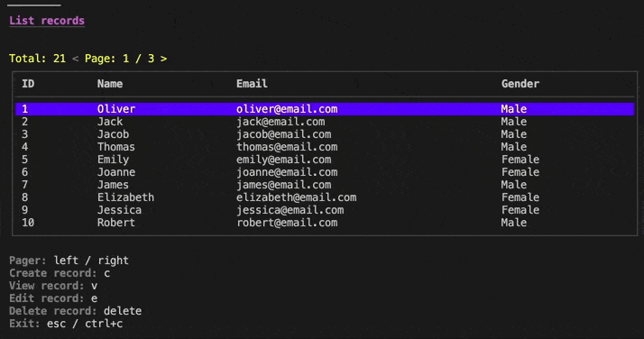

# Go CRUD Manager UI

[](https://godoc.org/github.com/era-dk/go-crud-manager-ui)



## Install

```bash
go get github.com/era-dk/go-crud-manager-ui
```

## Example

Check example in [example_test.go](example_test.go)
